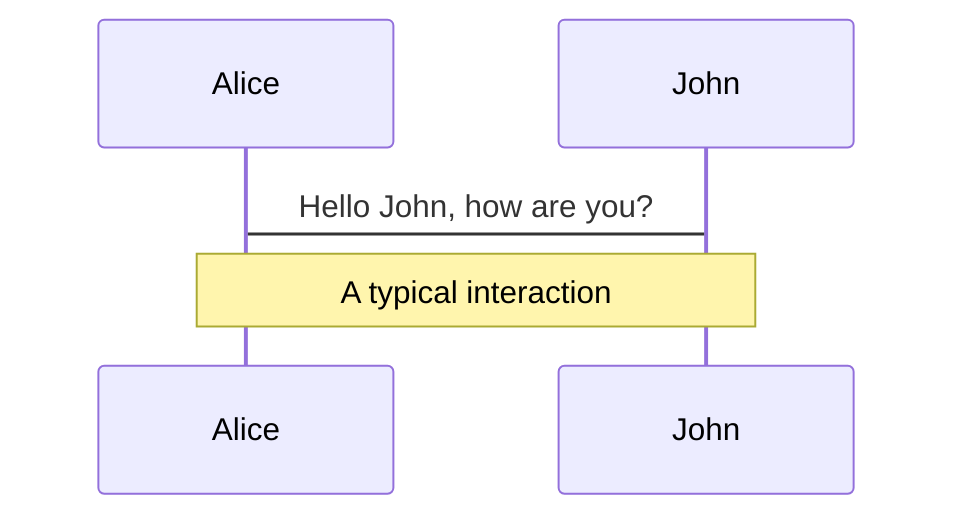
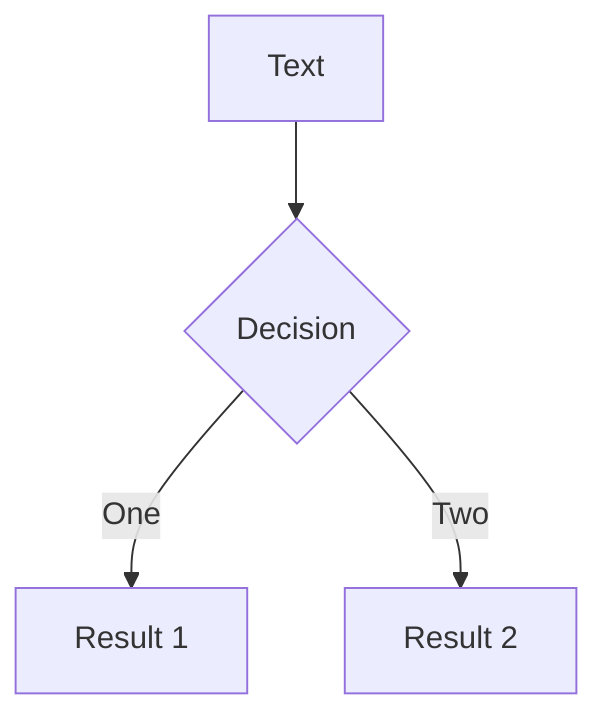
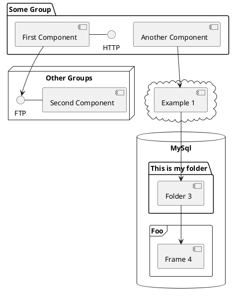

---
# try also 'default' to start simple
theme: seriph
# random image from a curated Unsplash collection by Anthony
# like them? see https://unsplash.com/collections/94734566/slidev
background: https://source.unsplash.com/collection/94734566/1920x1080
# apply any windi css classes to the current slide
class: "text-center"
# https://sli.dev/custom/highlighters.html
highlighter: shiki
# show line numbers in code blocks
lineNumbers: true
# some information about the slides, markdown enabled
info: |
  ## Slidev Starter Template
  Presentation slides for developers.

  Learn more at [Sli.dev](https://sli.dev)
# persist drawings in exports and build
drawings:
  persist: false
---

# Tailwind CSS

An introduction to tailwind css and
new features added to Tailwind CSS v3

Presented by Mahima Ramgolam

<div class="pt-12">
  <span @click="$slidev.nav.next" class="px-2 py-1 rounded cursor-pointer" hover="bg-white bg-opacity-10">
    <carbon:arrow-right class="inline"/>
  </span>
</div>

<div class="abs-br m-6 flex gap-2">
  <button @click="$slidev.nav.openInEditor()" title="Open in Editor" class="text-xl icon-btn opacity-50 !border-none !hover:text-white">
    <carbon:edit />
  </button>
  <a href="https://github.com/slidevjs/slidev" target="_blank" alt="GitHub"
    class="text-xl icon-btn opacity-50 !border-none !hover:text-white">
    <carbon-logo-github />
  </a>
</div>

<!--
The last comment block of each slide will be treated as slide notes. It will be visible and editable in Presenter Mode along with the slide. [Read more in the docs](https://sli.dev/guide/syntax.html#notes)
-->

---

# What is Tailwind Css?

<br>

- ## CSS framework made up of utility classes
<br>

```html
<div class="px-4 py-2 text-red-100"></div>
```

<br>

- ## Much lower-level than Bootstrap, Materialize etc..
<br>
<br>

<!--
You can have `style` tag in markdown to override the style for the current page.
Learn more: https://sli.dev/guide/syntax#embedded-styles
-->

<style>
h1 {
  background-color: #2B90B6;
  background-image: linear-gradient(45deg, #4EC5D4 10%, #146b8c 20%);
  background-size: 100%;
  -webkit-background-clip: text;
  -moz-background-clip: text;
  -webkit-text-fill-color: transparent;
  -moz-text-fill-color: transparent;
}

h2 {
  opacity: 75%;
}
</style>

---

# Example/

<div grid="~ cols-3 gap-4">
<div grid="col-span-2">

#### Desktop version


</div>
<div>

#### Mobile version


</div>
</div>

<br>
<br>

#### HTML

```html
<html>
  <body>
    <div class="wrapper">
      <button class="myButton">Hover me</button>
    </div>
  </body>
</html>
```

---

<div grid="~ cols-2 gap-4">
 
 <div>
 
 ## Using normal css

 <br>

```html
<style>
  .wrapper {
    display: flex;
    width: 100%;
    height: 150px;
    justify-content: center;
    align-items: center;
  }
  .myButton {
    padding: 10px 20px;
    background-color: rgb(101, 238, 220);
    border-radius: 10px;
    font-size: 25px;
  }
  .myButton:hover {
    background-color: rgb(13, 85, 85);
  }
  @media (max-width: 800px) {
    .myButton {
      padding: 8px 16px;
      background-color: pink;
      font-size: 16px;
    }
  }
</style>
```

 </div>

 <div>

## Using Tailwind Css

<br>

```html
<div class="wrapper flex w-full h-96 justify-center items-center">
  <button
    class="myButton px-4 py-2 md:px-8 md:py-4 bg-red-300 rounded-md hover:bg-teal-400 md:bg-blue-200 md:text-xl"
  >
    Hover me
  </button>
</div>
```

 </div>
</div>

---

## Modifiers

Tailwind includes modifiers for just about everything you’ll ever need, including:

- **Pseudo-classes**, like :hover, :focus, :first-child, and :required
- **Pseudo-elements**, like ::before, ::after, ::placeholder, and ::selection
- **Media queries**, like responsive breakpoints, dark mode, and prefers-reduced-motion

These modifiers can even be stacked to target more specific situations, for example changing the background color in dark mode, at the medium breakpoint, on hover:

```html
<button class="md:hover:first-child:text-purple-600 ...">Save changes</button>
```

---

# New features added to tailwind

<br>

- ## Just-in-Time (JIT) engine
- ## Scroll snap Api
- ## Color box shadow utilities
- ## Fancy underline styles
- ## Portrait and landscape mode

<style>
  h1 {
    text-decoration: underline;
  }

  h2 {
    margin-bottom: 4px;
  }

</style>

---

# Just-in-Time (JIT) engine

The new engine generates the styles you need for your project on-demand, and might necessitate some small changes to your project depending on how you have Tailwind configured.

taiwind.config.js

```html
module.exports = { mode: 'jit', // ... }
```

<br>

- #### **Lightning fast build times.**
- #### **Every variant is enabled out of the box.** Variants like focus-visible, active, disabled
- #### **Generate arbitrary styles without writing custom CSS** ultra specific value can be applied ex. `top-[-113px]`
<br>

<br>
<br>

### Examples

```html
<div class="text-[#FF0000] top-[-113px] w-[4rem]"></div>
```

---

# Scroll Snap API

Utilities for controlling how strictly snap points are enforced in a snap container. [learn more](https://tailwindcss.com/docs/scroll-snap-type)

<div grid="~ cols-2 gap-8">
  <div>

```html
<div class="snap-x ...">
  <div class="snap-center ...">
    
  </div>
  <div class="snap-center ...">
    
  </div>
  <div class="snap-center ...">
    
  </div>
  <div class="snap-center ...">
    
  </div>
</div>
```

  </div>

  <div>
    
    <br>
    <div v-click>
      <span>snap-start</span>
      
    </div>
  </div>

</div>

<!-- https://sli.dev/guide/animations.html#click-animations -->

<style>
  span {
    font-size: 12px;
    font-weight: 500px;
  }

  img{
    padding-top: 10px;
  }

</style>

---

# Color box shadow utilities

Use the shadow-{color} utilities to change the color of an existing box shadow. By default colored shadows have an opacity of 100%, but you can adjust this using the opacity modifier. [Learn more](https://tailwindcss.com/docs/box-shadow-color#setting-the-box-shadow-color)

<br>

  
  <br>

```html
<button class="bg-cyan-500 shadow-lg shadow-cyan-500/50 ...">Subscribe</button>
<button class="bg-blue-500 shadow-lg shadow-blue-500/50 ...">Subscribe</button>
<button class="bg-indigo-500 shadow-lg shadow-indigo-500/50 ...">
  Subscribe
</button>
```

---

# Portrait and landscape modifiers

Use the new portrait and landscape modifiers to conditionally add styles when the viewport is in a specific orientation:

```html
<div>
  <div class="portrait:hidden">
    <!-- ... -->
  </div>
  <div class="landscape:hidden">
    <p>
      This experience is designed to be viewed in landscape. Please rotate your
      device to view the site.
    </p>
  </div>
</div>
```

---

# Multi-column layout

Use as the newspaper layout kind. These are actually super useful, and are great for things like footer navigation layouts too.

<div grid="~ cols-2 gap-8">
<div>

</div>
<div>

```html
<div class="columns-2 sm:columns-3">
  <p>...</p>
  <!-- ... -->
</div>
```

</div>
  </div>

---

# Fancy underline styles

Now you can change underline colors, thickness, and more:


---

# Themes

Slidev comes with powerful theming support. Themes can provide styles, layouts, components, or even configurations for tools. Switching between themes by just **one edit** in your frontmatter:

<div grid="~ cols-2 gap-2" m="-t-2">

```yaml
---
theme: default
---
```

```yaml
---
theme: seriph
---
```


</div>

Read more about [How to use a theme](https://sli.dev/themes/use.html) and
check out the [Awesome Themes Gallery](https://sli.dev/themes/gallery.html).

---

## preload: false

# Animations

Animations are powered by [@vueuse/motion](https://motion.vueuse.org/).

```html
<div v-motion :initial="{ x: -80 }" :enter="{ x: 0 }">Slidev</div>
```

<div class="w-60 relative mt-6">
  <div class="relative w-40 h-40">
    
    
    
  </div>

  <div
    class="text-5xl absolute top-14 left-40 text-[#2B90B6] -z-1"
    v-motion
    :initial="{ x: -80, opacity: 0}"
    :enter="{ x: 0, opacity: 1, transition: { delay: 2000, duration: 1000 } }">
    Slidev
  </div>
</div>

<!-- vue script setup scripts can be directly used in markdown, and will only affects current page -->
<script setup lang="ts">
const final = {
  x: 0,
  y: 0,
  rotate: 0,
  scale: 1,
  transition: {
    type: 'spring',
    damping: 10,
    stiffness: 20,
    mass: 2
  }
}
</script>

<div
  v-motion
  :initial="{ x:35, y: 40, opacity: 0}"
  :enter="{ y: 0, opacity: 1, transition: { delay: 3500 } }">

[Learn More](https://sli.dev/guide/animations.html#motion)

</div>

---

# LaTeX

LaTeX is supported out-of-box powered by [KaTeX](https://katex.org/).

<br>

Inline $\sqrt{3x-1}+(1+x)^2$

Block

$$
\begin{array}{c}

\nabla \times \vec{\mathbf{B}} -\, \frac1c\, \frac{\partial\vec{\mathbf{E}}}{\partial t} &
= \frac{4\pi}{c}\vec{\mathbf{j}}    \nabla \cdot \vec{\mathbf{E}} & = 4 \pi \rho \\

\nabla \times \vec{\mathbf{E}}\, +\, \frac1c\, \frac{\partial\vec{\mathbf{B}}}{\partial t} & = \vec{\mathbf{0}} \\

\nabla \cdot \vec{\mathbf{B}} & = 0

\end{array}
$$

<br>

[Learn more](https://sli.dev/guide/syntax#latex)

---

# Diagrams

You can create diagrams / graphs from textual descriptions, directly in your Markdown.

<div class="grid grid-cols-3 gap-10 pt-4 -mb-6">







</div>

[Learn More](https://sli.dev/guide/syntax.html#diagrams)

---

layout: center
class: text-center

---

# Learn More

[Documentations](https://sli.dev) · [GitHub](https://github.com/slidevjs/slidev) · [Showcases](https://sli.dev/showcases.html)
